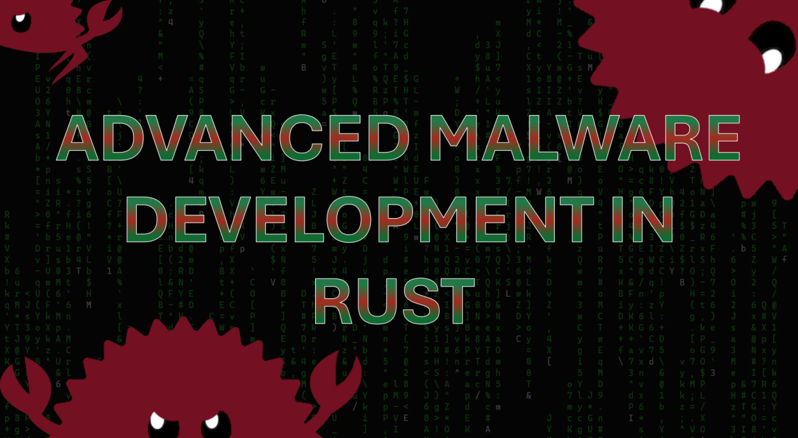

+++
title = "Malware developpement in Rust"
weight = 0
sort_by = "weight"
insert_anchor_links = "right"
+++

---

## Introduction

In this course, we will explore the delicate balance between technical mastery and ethics by delving into the field of malware development. Our main objective will be to highlight the fundamental skills needed to think and act like a malicious actor in the context of IT security.

It is important to note that the content of this course will focus exclusively on the offensive dimension of IT security. We will not be looking at malware analysis or detection. However, to assess the effectiveness of our own malware, we will use various malware detection solutions.

In the course of this exploration, we'll be taking a deep dive into the Rust programming language, renowned for its robustness and security. This will enable us to understand how to design malicious programs while deepening our knowledge of the underlying mechanisms of programming.

Be prepared to push back the boundaries of your knowledge while increasing your awareness of the ethical and legal implications of these practices.

---

## What's a malware ?

Malware, which is short for "malicious software", is a program designed to cause damage to a computer system.

Malware is generally created by malicious individuals, and its most common motivations are as follows:

- **Intelligence and intrusion**: Used to extract data such as emails and internal information from companies or individuals, with a particular focus on sensitive data such as passwords.
- **Disruption and extortion**: Some malware locks down networks and computers, rendering them completely unusable. When these programs take a machine hostage in exchange for a ransom, they are known as ransomware. Malicious individuals demand payment to decrypt the data and make the machine operational again.
- **Destruction or vandalism**: Other malware aims to destroy computer systems, causing damage to the network infrastructure and consequent financial losses.
- **Theft of computing time**: Some malware uses the computing power of infected machines to run botnets, cryptomining programmes or to send spam.

---

## Why develop your own malwares ?

As part of a red team exercise, penetration test or security audit, a penetrator[6] uses automated tools. The common practice is to use existing tools, whether open-source such as Metasploit or proprietary such as Cobalt-Strike, to enable automated control of target and compromised machines.

However, this raises a major problem. There are risks involved in running programs whose instructions we don't control on our customers' machines. We could be faced with unforeseen behaviour, or even worse, the execution of harmful code hidden either by the publisher itself or by a third party through a provisioning attack (a computer attack on a supplier with lesser security, which enables the target's protections to be bypassed). What's more, most offensive tools are now well known to detection systems such as anti-virus or EDRs, which makes it almost impossible to use them without being detected, especially when using scripts or programs available on GitHub.

In the case of open-source tools, it is certainly possible to read the entire code, but this can be complex. The code may be written in a language that is not part of our expertise, or the programme may be riddled with bad practices that make it difficult to decipher.

It is also possible to use malware development to raise the level of our services and offer malware similar to that used by real attackers. This approach offers greater control over our actions and a complete understanding of the tool, with the advantage of increasing our chances of going undetected and adapting to each infrastructure on which we carry out an attack.

However, it is essential to remember that this practice must be carried out under strict supervision and rigorous control, in compliance with cybercrime legislation, obtaining the appropriate authorisations from the parties concerned, with great caution and in strict compliance with the laws (and ethics) in force.

---

## Why develop your malwares in Rust ?

In general, offensive tools are developed in programming languages such as C, C++, Python or Java, and more recently in Go. However, each of these languages has limitations that make them less than ideal for the task. It's often more complex to write robust programs in C or C++, Python can be slow, and its weak typing makes it less suitable for large programs. Java depends on a heavy execution environment that may not meet all the requirements when developing malware.

This is where Rust, a new programming language, comes in:

Rust is a modern system programming language renowned for its advantages in terms of security and memory management performance. Developed by Mozilla, Rust combines the low-level control of languages like C and C++ with advanced memory management features that prevent common programming errors, such as null pointer dereferences and data races between threads.

Its ownership and borrowing system applies strict rules at compile time, guaranteeing secure code without the need for a garbage collector. This memory management mechanism automates the release of borrowed memory, relieving developers of this task.

There are many advantages to developing malware in Rust:

- **Security and Robustness**: Rust aims to minimise common programming errors, which can result in malware that is more stable and less prone to unforeseen problems.

- **Performance**: Rust offers performance comparable to that of low-level languages such as C and C++, which is crucial for the development of malware that exploits vulnerabilities or carries out sophisticated attacks.

- **Concurrency and parallelism**: If your malware requires the simultaneous manipulation of several processes, Rust offers built-in mechanisms for managing concurrency and parallelism in complete security.

- **Anti-reverse engineering**: Due to its relative rarity as a language of choice for malware, analysing binaries written in Rust is more complex than analysing binaries written in C or other more common languages.

- **Cross-platform**: Rust greatly simplifies cross-platform development, making it possible to write platform-specific code.
